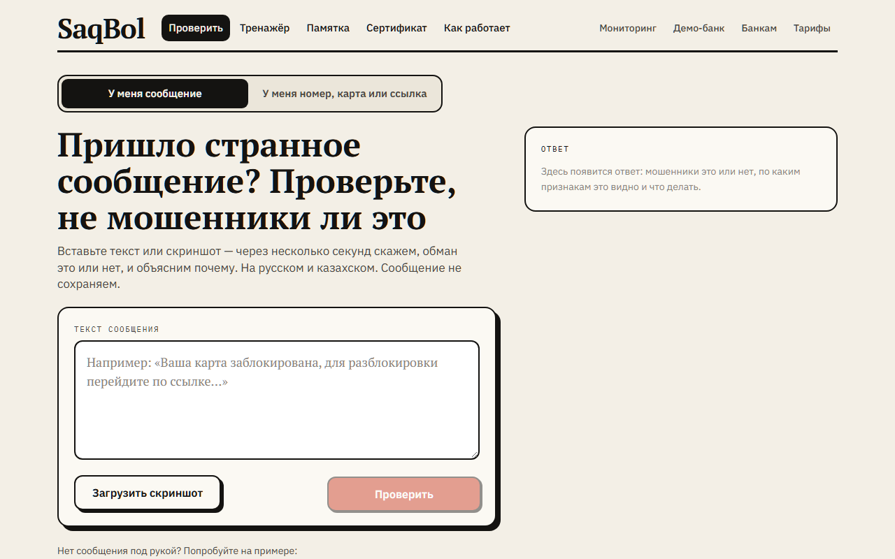
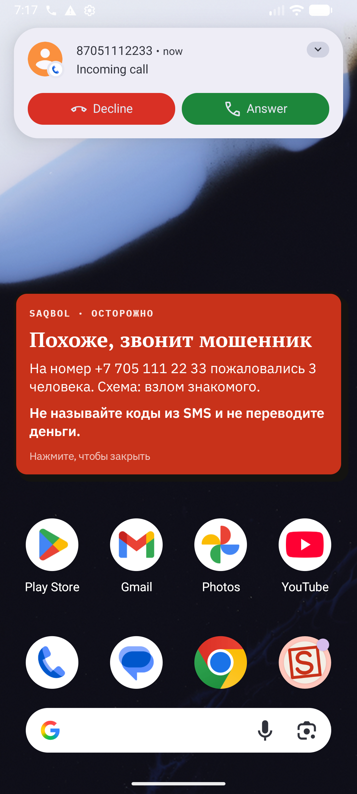
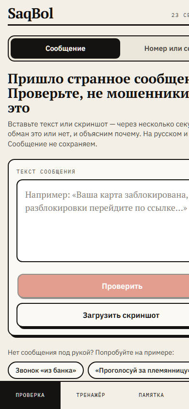
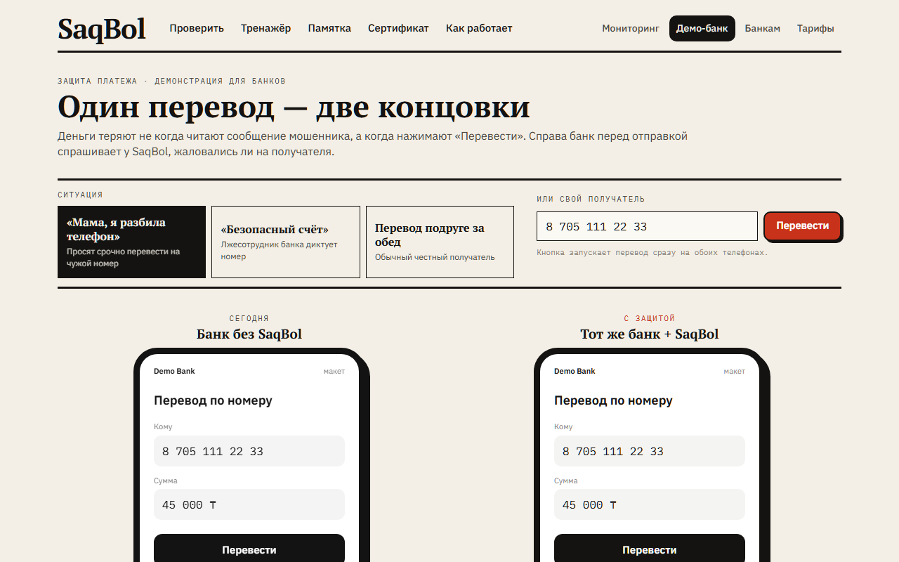
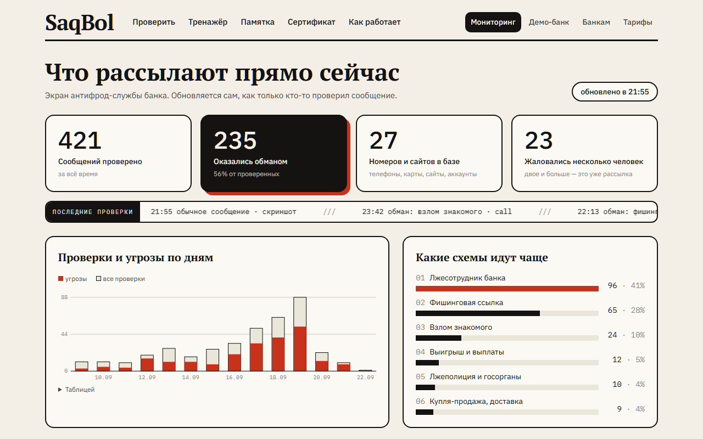

<p align="center">
  
</p>

<h1 align="center">SaqBol — будь осторожен</h1>

<p align="center">
  <b>Народная сеть датчиков мошенничества для Казахстана.</b><br>
  Один человек засомневался — предупреждены все.
</p>

<p align="center">
  <a href="https://saqbol-ai-kz.web.app"></a>
  <a href="https://t.me/saqbolai_bot"></a>
  
  
  
</p>

<p align="center">
  
</p>

Человек пересылает подозрительное сообщение, скриншот, голосовое или QR-код — и за несколько секунд получает ответ простыми словами: мошенники это или нет, какая схема, по каким признакам видно и что делать. Номера, карты, ссылки и аккаунты из мошеннических сообщений попадают в **общую базу**. Следующий, кому придёт тот же номер, увидит «на него уже жаловались N человек», а банк может сверить получателя перевода с базой **до списания денег**.

Проект студентки ЕНУ им. Л.Н. Гумилёва для республиканского конкурса студенческих проектов Ассоциации банков РК «Твори, дерзай, побеждай», 2026. Треки: Cybersecurity, AI for Finance.

## Почему это нужно

- **26,3 тыс.** интернет-мошенничеств за январь–ноябрь 2025 года — в 3,4 раза больше, чем в 2019-м. Ущерб **11,2 млрд ₸**, из них **96,7 %** — деньги обычных людей ([Генпрокуратура РК](https://informburo.kz/novosti/rekordnoe-kolicestvo-skolko-slucaev-mosennicestva-v-seti-zaregistrirovali-v-kazaxstane-v-2025-godu)).
- Банк узнаёт о мошеннике **после** перевода и только если пострадавший заявил. Заявляет лишь **каждый пятый**.
- Антифрод-центр Нацбанка за всё время работы заблокировал 2,8 млрд ₸ ([Нацбанк РК](https://nationalbank.kz/ru/news/informacionnye-soobshcheniya/18571)) — он видит операцию, когда перевод уже идёт.

**SaqBol собирает сигнал раньше всех — в момент, когда человек только сомневается.** Мы не конкурент Антифрод-центру, а ранний датчик для него. Все цифры с источниками — в [`docs/A6-cifry-kz.md`](docs/A6-cifry-kz.md).

## Три входа в одну сеть

| Telegram-бот | Сайт | Android-приложение |
|---|---|---|
| Проверить и сообщить | Научиться и показать банку | Защита в момент звонка |
| Текст, скриншоты, **голосовые**, проверка номера, тренажёр, «разговор с мошенником», памятка | Проверка сообщения и получателя, тренажёр, сертификат, памятка для родителей, мониторинг, **Демо-банк**, тарифы | **Предупреждение поверх экрана звонка**, **«Защита близких»** — родственник получает сообщение в Telegram, когда маме звонит номер из базы, «Кто звонил?» после звонка, «Поделиться → SaqBol», **сканер QR-кода** |

<p align="center">
  
  &nbsp;&nbsp;
  
</p>

### Один перевод — две концовки

Макет банка для жюри и антифрод-служб: слева перевод уходит мошеннику, справа тот же банк спрашивает SaqBol и останавливает платёж.

<p align="center">
  
</p>

### Что рассылают прямо сейчас

Экран антифрод-службы: обновляется сам после каждой проверки, показывает схемы недели и базу с риск-скорингом.

<p align="center">
  
</p>

## Как это работает

```
 сообщение · скриншот · голосовое · QR          звонок с незнакомого номера
              │                                            │
   ┌──────────▼──────────┐                      ┌──────────▼───────────┐
   │ 1. Правила          │  без сети, мгновенно │ сверка номера с базой│
   │ 13 признаков RU/KZ, │                      │ → плашка поверх      │
   │ 24 домена банков,   │                      │   экрана звонка      │
   │ похожие адреса      │                      └──────────┬───────────┘
   └──────────┬──────────┘                                 │
   ┌──────────▼──────────┐                      «Это мошенники» — одно нажатие
   │ 2. Языковая модель  │  смысл, а не слова              │
   │ вердикт, схема,     │                                 │
   │ признаки, совет     │                                 │
   └──────────┬──────────┘                                 │
              ▼                                            ▼
        ┌─────────────────────────────────────────────────────────┐
        │  ОБЩАЯ БАЗА: телефоны, карты, ссылки, @аккаунты          │
        │  риск 1–99 по числу независимых заявителей и давности    │
        └───────────────┬───────────────────────┬─────────────────┘
                        ▼                       ▼
              человеку: «уже жаловались   банку: проверка получателя
              N человек»                  до перевода
```

- **Два слоя.** Правила ловят поддельные домены банков и типовые формулировки, модель понимает смысл. Страховка: сообщение с поддельным адресом банка не может получить «безопасно», что бы ни ответила модель. Без ключа модели всё работает на правилах.
- **Объяснимо.** Человек видит признаки словами, аналитик банка — формулу риска: 1 заявитель → 30, 2 → 50, 3 → 65, 10 → 97; вес жалоб падает вдвое за 30 дней.
- **Защита от накрутки.** Заявители считаются по обезличенному коду, повторная жалоба счётчик не растит, с одного устройства — не больше 5 жалоб в сутки. Одна жалоба — только предупреждение.
- **Данные.** Тексты сообщений, скриншоты и голосовые не хранятся — запрос удаляется сразу после ответа. Наружу уходят только агрегаты и замаскированные номера. Правила доступа к базе открыты: [`saqbol-site/firestore.rules`](saqbol-site/firestore.rules).

## Метрики

90 размеченных сообщений на русском и казахском: 45 мошеннических, 45 обычных, 30 намеренно трудных. Датасет — [`saqbol-bot/eval/dataset.jsonl`](saqbol-bot/eval/dataset.jsonl), воспроизведение — `python eval/run_eval.py --llm`.

| Режим | Accuracy | Precision | Recall | F1 | Пропущено мошеннических | Трудные кейсы |
|---|---|---|---|---|---|---|
| Только правила | 0.811 | 0.818 | 0.800 | 0.809 | 9 из 45 | 18 из 30 |
| Правила + модель | **0.989** | 0.978 | **1.000** | **0.989** | **0 из 45** | 29 из 30 |

Единственная ошибка — ложная тревога на «можешь занять 5000». Для защиты денег это правильная сторона ошибки. Честная оговорка: набор составлен авторами по реальным схемам, следующий шаг — проверка на потоке банка-партнёра.

## Устройство репозитория

```
saqbol-bot/      Python 3.14 · aiogram · Telegram-бот и вся серверная логика
  saqbol/rules.py         слой 1 — правила, работает без сети
  saqbol/llm.py           слой 2 — языковая модель (Gemini, Claude как запасной)
  saqbol/analyzer.py      склейка слоёв в один вердикт
  saqbol/indicators.py    телефоны, карты (Luhn), домены, @аккаунты
  saqbol/store.py         общая база в Firestore, риск-скоринг, сводка
  saqbol/webqueue.py      очередь запросов с сайта и приложения
  saqbol/simulator.py     «Разговор с мошенником»
  saqbol/chat_features.py тренажёр, памятка, проверка номера в Telegram
  eval/                   датасет и скрипт метрик
saqbol-site/     Next.js 16 · TypeScript · Tailwind — статический экспорт на Firebase Hosting
saqbol-android/  Kotlin · Jetpack Compose — определитель звонков, «Поделиться», сканер QR
docs/            цифры по Казахстану с источниками, материалы заявки, скриншоты, тестовые QR
```

Отдельного бэкенда у сайта и приложения нет: они кладут запрос в очередь Firestore, бот обрабатывает его и пишет ответ под тем же id. Одна проверка обходится примерно в 1 ₸; расход на модель за всю разработку — меньше одного цента.

## Запуск

```
cd saqbol-bot
python -m venv .venv && .venv\Scripts\pip install -r requirements.txt
copy .env.example .env         # TELEGRAM_BOT_TOKEN и GEMINI_API_KEY
# firebase-key.json — ключ сервис-аккаунта Firebase, положить рядом с bot.py
.venv\Scripts\python bot.py
```

```
cd saqbol-site && npm install && npm run dev            # http://localhost:3000
npx next build && npx firebase-tools deploy --only hosting
```

Приложение: открыть `saqbol-android` в Android Studio или `./gradlew assembleDebug` (JDK 21).

## План развития

| Этап | Что |
|---|---|
| **Сейчас — TRL 4** | Работающий прототип: бот, сайт, приложение, Демо-банк, метрики на тестовом наборе |
| **3 месяца — TRL 5** | Пилот с одним банком, 1 000 живых пользователей, казахский интерфейс сайта |
| **6–12 месяцев — TRL 6–7** | Подключение к антифрод-системе банка, обмен данными с Антифрод-центром, ранний сигнал о новой схеме по всплеску похожих сообщений |
